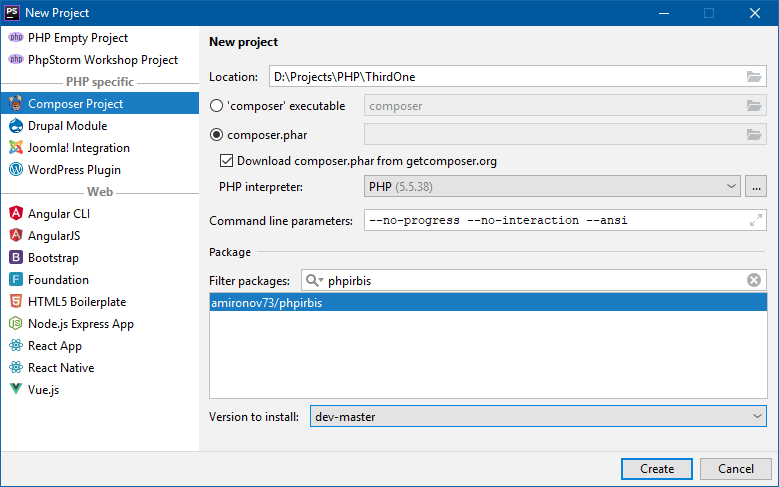

# PhpIrbis

ManagedIrbis ported to PHP 5. Available on Packagist.

[](https://packagist.org/packages/amironov73/phpirbis) 
[](https://packagist.org/packages/amironov73/phpirbis)
[](https://packagist.org/packages/amironov73/phpirbis)
[](https://packagist.org/packages/amironov73/phpirbis)

Now supported PHP 5.4+ on Windows (Open Server) and Ubuntu Linux.



```php
require_once 'PhpIrbis.php';

$connection = new IrbisConnection();
$connectString = 'host=127.0.0.1;user=librarian;password=secret;';
$connection->parseConnectionString($connectString);

if (!$connection->connect()) {
    echo "Can't connect!";
    die(1);
}

$found = $connection->search('"A=Byron, George$"');
echo "<p>Records found: " . count($found) . "</p>\n";

foreach ($found as $mfn) {
    $record = $connection->readRecord($mfn);

    $title = $record->fm(200, 'a');
    echo "<p><b>Title:</b> {$title}<br/>";

    $description = $connection->formatRecord("@brief", $mfn);
    echo "<b>Description:</b> {$description}</p>\n";
}

$connection->disconnect();
```

#### Documentation (in russian)

* [**Общее описание**](Docs/chapter1.md)
* [**Класс IrbisConnection**](Docs/chapter2.md)
* [**Классы MarcRecord, RecordField и SubField**](Docs/chapter3.md)
* [**Прочие (вспомогательные) классы и функции**](Docs/chapter4.md)

